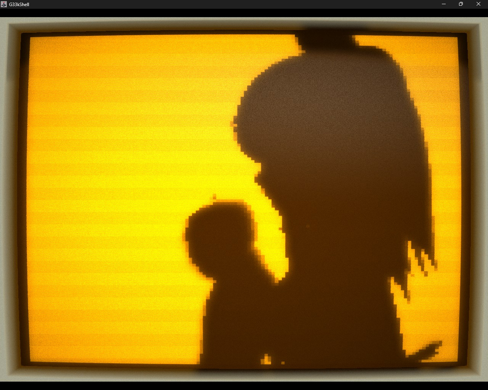

# How I Squeezed 6,572 Frames of Bad Apple into a 988 KB Screensaver

G33kShell contains a growing collection of screensavers: fire, plasma, AI Snake, ASCII Asteroids, a tiny aquarium and several effects that were probably more sensible uses of my time.

Then I added Bad Apple.

The source animation arrived as 6,572 JPEG images at 480×360 and 30 frames per second. Shipping those files with a terminal screensaver would have been gloriously inefficient. The target display was monochrome and deliberately low-resolution, so there had to be a much smaller representation.

The final asset is 987,617 bytes.

The most useful optimisation was not an elaborate video codec. It was rotating the frames.



## Throw away what the screen cannot show

The G33kShell pixel surface does not need 480×360 greyscale frames. I reduced each image to 128×120, converted it to one bit per pixel and sampled the animation at 24 fps.

That produced 5,258 monochrome frames. Packed naively at one bit per pixel, they would occupy roughly 9.6 MiB:

```text
128 × 120 pixels × 5,258 frames ÷ 8 ≈ 9.6 MiB
```

Already much better than thousands of JPEGs, but still rather large for a novelty embedded inside a desktop shell.

## Alternating runs

A monochrome frame is a sequence of black and white pixels. Store the initial colour, then record how long it continues before toggling.

In my format, run bytes from `1` to `255` draw that many pixels and switch colour. A zero byte extends the current colour by another 255 pixels without switching. Long areas of black or white therefore become a short sequence of bytes.

The run stream continues across frame boundaries. There is no fresh header or colour reset for each frame; the decoder simply knows that every 15,360 pixels complete another 128×120 image.

That detail saves a little framing overhead, but more importantly gives the final compressor one continuous stream to work with.

```text
1-bit pixels → alternating run bytes → frame boundaries from pixel count → LZ4
```

## Rotate first, compress second

Run-length encoding is extremely sensitive to traversal direction.

Read a silhouette row by row and an edge may create many short black/white changes. Read the same image down columns and large regions may remain the same colour for much longer—or vice versa.

For Bad Apple, rotating every frame by 270 degrees before encoding produced substantially fewer runs. Playback rotates the pixels back while decoding into the screen buffer.

It sounds like a visual operation, but here rotation is really a data-layout optimisation. Nothing about the displayed animation changes. The serial order of its pixels becomes friendlier to the compressor.

The continuous rotated RLE stream is 1,358,933 bytes. Passing that through the existing LZ4 helper reduces it to 987,617 bytes.

| Stage | Size |
|---|---:|
| Raw 128×120, 1bpp, 24 fps | ~9.6 MiB |
| Rotated continuous RLE | 1,358,933 bytes |
| LZ4-packed asset | 987,617 bytes |

## Cleverer ideas that lost

I tried several formats that sounded more sophisticated:

- Dictionaries of repeated rows.
- References to duplicate frames.
- Cropped bounds around changed regions.
- XOR deltas against the previous frame.
- Bit-packed run tokens.
- Reusing previous rows.
- Wider 16-bit run lengths.

They either made the format more complicated for very little gain or produced data that compressed less effectively afterward.

## Playback stays simple

The decoder needs only a current colour, a remaining run length and a pixel position. It expands enough pixels to fill the next frame, rotates their destination coordinates and hands the completed buffer to the screensaver.

There is no collection of thousands of files, no general-purpose video decoder and no temporary frame extraction. The whole animation is one application asset with a tiny purpose-built decoder.

That matters in G33kShell because a screensaver should start promptly, finish cleanly and hand control back without leaving a heavyweight playback system behind.

## The useful lesson

The final result came from three blunt transformations:

1. Remove resolution and frame rate the target cannot use.
2. Reorder the remaining data so simple runs become longer.
3. Let a conventional compressor exploit the resulting byte patterns.

None is especially clever alone. Together they turned a directory of 6,572 images into a sub-megabyte asset.

All so that a fake retro terminal can play a monochrome music video when nobody is typing into it.

Entirely reasonable.

Explore G33kShell and its many other screensavers on [GitHub](https://github.com/deanthecoder/G33kShell).
