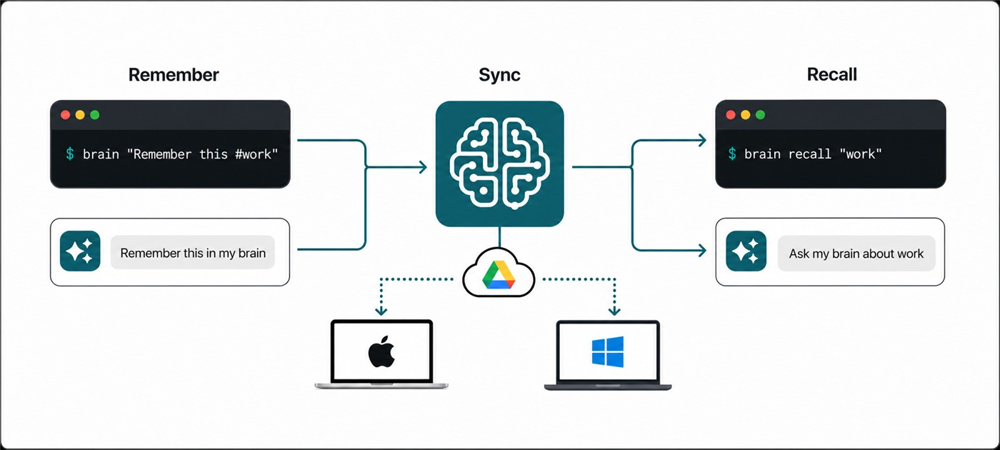

# I'm old and need a 'memory' upgrade

I often remember that a decision was made without remembering where it was made.  Or at least, I _think_ I remember...

It might be in a chat, an issue, a notebook, a source-code comment or a message from somebody whose name I do at least remember. Finding it again takes longer than recording it would have—provided recording it does not require choosing the perfect document and organising it first.

Brain is a small command-line memory store designed around that problem. It's quick and easy to use, works across machines, can remember files, people, hashtags - Perfect for day to day use.

```text
brain "@Bob says 16-bit support is not needed for the new imaging feature"
brain recall "16 bit"
```

Capture should be nearly effortless. Storage should remain readable and portable. As it comes with an optional Codex skill, AI can help me use the memories, which makes developing new coding ideas quicker and simpler.



## The command line is the capture interface

Opening an application creates just enough friction to defer writing something down.

Brain accepts a thought directly as its default command. There is no mandatory title, folder or form. Clear signals inside the text become metadata:

- `@Bob` identifies a person.
- `#todo` marks a task.
- `#tag` supplies a category.
- URLs and email addresses are recognised.
- `@file:path` copies and attaches a file.

The parsing is deterministic. Brain does not send the sentence to a model and ask what it probably means. Ambiguous text remains text.

That boundary makes capture predictable and keeps the stored entry faithful to what I actually wrote.

## Plain data before clever retrieval

Memories are stored as readable JSON, while attached files are kept as content-addressed binary blobs. The data remains inspectable and exportable without Brain or an AI service.

Entries are effectively immutable. Replacing a memory creates a new entry and records the old one as forgotten. Those tombstones also synchronise, preventing another computer from resurrecting deleted information during its next merge.

Attachments are deduplicated by hash. If several memories reference the same file, it is stored once. When the last reference disappears, the blob is retained for a grace period before pruning rather than being destroyed immediately.

These are not exciting features in a screenshot, but they are what make a memory tool trustworthy after the novelty wears off.

```text
memory.json ──references──▶ attachment hash ──▶ deduplicated blob
     │
     └──replaced/forgotten──▶ synchronised tombstone
```

## Private cross-machine sync

Brain can connect to Google Drive on each computer, but it uses Drive’s hidden application-data area rather than placing a folder of internal files among the user’s documents.

The CLI periodically pulls changes before reads and pushes after capture. An offline switch disables both the version check and synchronisation when a command should remain local.

## Codex is a client, not the database

Brain includes a Codex skill that recognises requests such as:

- “Remember this in my brain.”
- “Ask my brain what we decided about iOS.”
- “Check my brain for anything Bob said about installers.”
- “Review my brain and suggest duplicates.”

The skill calls the same CLI a person can use. It does not edit Brain’s storage directly. Structured JSON output gives the integration a stable interface, while the command owns validation, search, replacement and deletion.

This is an important separation. Codex makes the system conversational, but it does not become the source of truth. The memory remains useful from an ordinary terminal, and every mutating operation still passes through the same application rules.

The project began as a way to remember small facts, ideas and 'todo' items. I'm glad I have it!

Brain is available on [GitHub](https://github.com/deanthecoder/Brain), including its command-line app and Codex skill.
