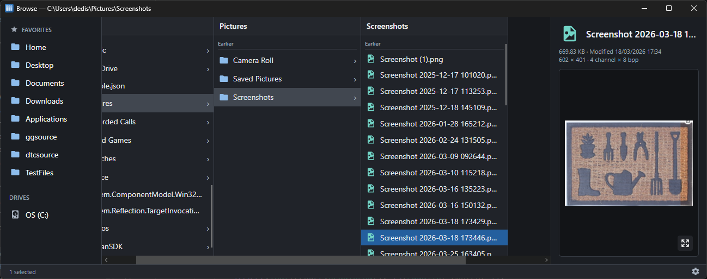
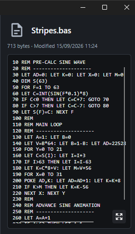

# Why I Built Finder’s Column View for Windows

I am a professional software developer that for many years has been equally at home on both Mac and Windows. Nearly. After all this time, I still prefer the Mac and miss not having its column-based file browser when I'm on Windows.

In Finder’s column view each selected folder opens the next column to its right, leaving the surrounding hierarchy visible. Moving through a deep tree feels less like repeatedly opening pages and more like pointing at the branch you want.

Browse brings that model to Windows and macOS in a focused cross-platform file manager built with Avalonia.
To be honest I _still_ use Finder on the Mac, but having Mac support for Browse was much more convenient given 95% of the app was written on that OS. Plus [Avalonia](https://avaloniaui.net/) makes writing cross-platform C# apps pretty effortless.

## Keep the path visible

Each column represents one directory. Selecting a folder creates or replaces the column to its right. The active path therefore exists as visible content rather than only as text in an address bar.

This changes keyboard navigation too. Up and down move within a directory; right enters the selected folder; left returns to the parent while preserving context. Typing jumps to matching names or file extensions. A filter narrows the active column without affecting the others.

Favorites and drives remain in the sidebar, while a “Go to” command accepts normal paths, UNC locations and aliases such as `home`, `downloads`, `temp` and `localappdata`.

The design is intentionally compact, fast, and easy to use.

## Preview enough, then stop

A preview pane can quietly turn a fast file manager into a slow document viewer.

Browse supports images, video thumbnails, PDFs, text, Markdown, HTML, JSON, XML, source code, ZIP contents, executable metadata and a conventional hex/ASCII view for unknown binary files. The rule is that preview work must remain bounded.

Large inputs are sampled rather than swallowed whole. Expensive work is cancelled when the selection changes. Large text and hex views use virtualised editors. Folder sizes are calculated only when requested. Image and video processing has explicit limits.

This matters because users navigate faster than previews can finish. If selecting five files launches five pieces of work that all run to completion, the application feels worse precisely when somebody uses it quickly.

## File management, not just file viewing

Browse supports multi-selection, copy, cut, paste, rename, drag/drop and recycle-bin deletion. It can create and expand ZIP archives, open a terminal at the current location, calculate hashes and copy command-line-ready paths.

Longer operations report activity on the relevant row and in the status area rather than freezing the window. Multiple Browse windows keep independent locations and state.

These features are not unusual individually. The challenge is fitting them into a column model without allowing operations in one part of the hierarchy to leave the other columns stale.

## A familiar idea in a new place

Browse is not trying to replace every feature of Explorer or Finder. It exists because one particular navigation model fits the way I move through source trees and collections of files.

Browse the source and current releases on [GitHub](https://github.com/deanthecoder/Browse).
